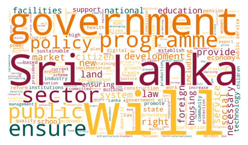

# 2024 Sri Lankan Presidential Election Manifestos (manifestos_prespollsl2024)

This repository contains the manifestos I could find as of **2024-09-03 15:51:56**. 

## Ranil Wickremesinghe (Independent)

* [English (62 Pages, Images Only, 30.9MB)](https://raw.githubusercontent.com/nuuuwan/manifestos_prespollsl2024/main/data/pdf/ind-rw-en.pdf) · [Original Source](https://www.ranil2024.lk/manifesto)
* [සිංහල (62 Pages, 11.1K Words, 11.7MB)](https://raw.githubusercontent.com/nuuuwan/manifestos_prespollsl2024/main/data/pdf/ind-rw-si.pdf) · [Original Source](https://www.ranil2024.lk/si/manifesto)
* [தமிழ் (62 Pages, 10.3K Words, 5.1MB)](https://raw.githubusercontent.com/nuuuwan/manifestos_prespollsl2024/main/data/pdf/ind-rw-ta.pdf) · [Original Source](https://www.ranil2024.lk/ta/manifesto)

## Dilith Jayaweera (Sarvajana Balaya)

* [සිංහල (66 Pages, 21.0K Words, 8.7MB)](https://raw.githubusercontent.com/nuuuwan/manifestos_prespollsl2024/main/data/pdf/mjp-si.pdf) · [Original Source](https://www.scribd.com/document/764382431/Presidential-Candidate-Dilith-Jayaweera-unveils-national-strategic-plan)

## Anura Kumara Dissanayake (National People's Power)

[Summary](data/summary/npp-en.md)

* [English (129 Pages, 36.3K Words, 17.5MB)](https://raw.githubusercontent.com/nuuuwan/manifestos_prespollsl2024/main/data/pdf/npp-en.pdf) · [Original Source](https://www.npp.lk/up/policies/en/npppolicystatement.pdf)
* [සිංහල (233 Pages, 38.3K Words, 26.9MB)](https://raw.githubusercontent.com/nuuuwan/manifestos_prespollsl2024/main/data/pdf/npp-si.pdf) · [Original Source](https://www.npp.lk/up/policies/si/npppolicystatement.pdf)
* [தமிழ் (233 Pages, 16.0K Words, 8.0MB)](https://raw.githubusercontent.com/nuuuwan/manifestos_prespollsl2024/main/data/pdf/npp-ta.pdf) · [Original Source](https://www.npp.lk/up/policies/ta/npppolicystatement.pdf)

## Sajith Premadasa (Samagi Jana Balawegaya)

[Summary](data/summary/sjb-en.md)

* [English (44 Pages, 10.9K Words, 21.0MB)](https://raw.githubusercontent.com/nuuuwan/manifestos_prespollsl2024/main/data/pdf/sjb-en.pdf) · [Original Source](https://cdn.prod.website-files.com/667c056ef89cca890b53adad/66d32e4698e32d285739c6ac_SajithPremadasa_policy-manifesto-english-compressed.pdf)
* [සිංහල (38 Pages, 12.5K Words, 20.4MB)](https://raw.githubusercontent.com/nuuuwan/manifestos_prespollsl2024/main/data/pdf/sjb-si.pdf) · [Original Source](https://cdn.prod.website-files.com/667c056ef89cca890b53adad/66d32ef6a457cbb2fd19ac73_SajithPremadasa_policy-manifesto-sinhala-compressed.pdf)
* [தமிழ் (60 Pages, 16.5K Words, 4.3MB)](https://raw.githubusercontent.com/nuuuwan/manifestos_prespollsl2024/main/data/pdf/sjb-ta.pdf) · [Original Source](https://cdn.prod.website-files.com/667c056ef89cca890b53adad/66d32e462d19d928e43d0d0b_SajithPremadasa_policy-manifesto-tamil-compressed.pdf)

## Namal Rajapakse (Sri Lanka Podujana Peramuna)

[Summary](data/summary/slpp-en.md)

* [English (49 Pages, 6.9K Words, 5.4MB)](https://raw.githubusercontent.com/nuuuwan/manifestos_prespollsl2024/main/data/pdf/slpp-en.pdf) · [Original Source](https://www.nr.lk/pdf/NAMAL_VISION%202025-2035%20%20(En)%20.pdf)
* [සිංහල (50 Pages, 10.0K Words, 5.6MB)](https://raw.githubusercontent.com/nuuuwan/manifestos_prespollsl2024/main/data/pdf/slpp-si.pdf) · [Original Source](https://www.nr.lk/pdf/NR2024_MANIFESTO_SINHALA_PRESSQ.pdf)
* [தமிழ் (12 Pages, Images Only, 26.1MB)](https://raw.githubusercontent.com/nuuuwan/manifestos_prespollsl2024/main/data/pdf/slpp-ta.pdf) · [Original Source](https://www.nr.lk/pdf/NR2024_MANIFESTO_TAMIL_PRESSQ.pdf)

📦 Where possible, images in the original source PDFs have been compressed.

⚠️ Word counts are approximate and may not be accurate, especially for non-English text.